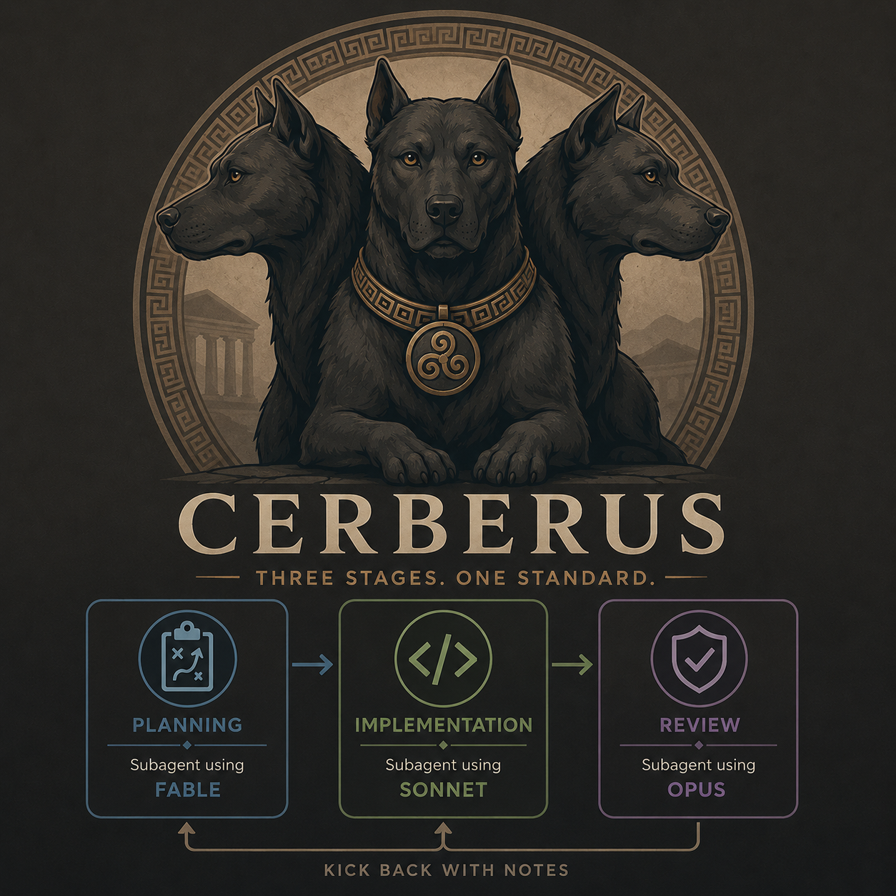

# Cerberus



A Claude Code skill that runs any coding task through a **three-headed pipeline** — plan → implement → review — each phase handled by a fresh subagent on a right-sized model, and keeps a git-ignored worklog of token usage and cost that rolls up per week.

Cerberus guarded the underworld with three heads. This skill guards code quality with three subagents:

| Head | Phase | Default model | What it does |
|---|---|---|---|
| 1 | **Planning** | Fable (top available) | Reads conventions + the task, returns an implementation plan. No code. |
| 2 | **Implementation** | Sonnet | Follows the plan, makes the change, builds + verifies, commits code. |
| 3 | **Review** | Opus (≥ implementation tier) | Independently re-reads the diff and re-runs verification, then approves or bounces. |

The main session acts as an **orchestrator**: it picks the task, dispatches each head as an isolated subagent, records what each phase cost, and reports back. It never does the plan/build/review work in its own context — that isolation is what keeps the orchestrator small enough to drive task after task.

## What it is not

Cerberus is **not a ticket tracker**. It creates no per-task markdown. The task lives in the Claude Code session and is worked there. The *only* thing written to disk is a git-ignored `worklog/` folder recording token usage and cost.

## Why this workflow

Splitting a task across three fresh subagents isn't just about assigning the right model to each phase — the isolation itself is the advantage.

- **Fresh context per phase.** Each subagent starts clean, with only the task and the conventions it needs — not the full transcript of everything that came before. It pursues a single goal (plan, implement, or review), produces a result, and ends. Nothing else accumulates in its window.
- **More efficient with tokens.** A long single session carries its entire history forward on every turn, so the context window keeps growing and each step gets more expensive. Three scoped subagents each pay only for what their own phase needs. The costly history of planning doesn't ride along into implementation, and implementation's doesn't ride along into review.
- **A small, durable orchestrator.** Because the heavy work happens inside subagents that close when done, the main session stays lean. It dispatches, records the cost, and moves on — able to drive task after task without its own context ballooning.
- **Cleaner handoffs.** Each phase hands the next a distilled result (a plan, a diff, a verdict) rather than a stream of intermediate reasoning. The next head reasons from a crisp starting point instead of sifting the previous head's thinking.
- **Independent review.** The reviewer never shares the implementer's context, so it can't inherit the implementer's blind spots or assumptions. It re-reads the diff and re-runs verification from scratch — a genuine second opinion.

## Key features

- **Three-phase, subagent-isolated pipeline** with a strict invariant: the review model is always at least as strong as the implementation model, so the reviewer can catch what the implementer missed. A fallback ladder covers cases where not every model tier is available.
- **Mandatory verification** in both implementation and review — "it compiles" is never accepted as "it works." The reviewer re-runs verification independently rather than trusting the implementer's claim.
- **Git-ignored worklog** (`worklog/`) that never enters source control, holding one row per subagent dispatch: date, task, phase, model, token counts, and computed cost.
- **Weekly cost rollup** — worklog files are grouped by ISO week (`YYYY-Www.md`). Ask "what has this week cost?" or "does this fit my plan?" and the skill sums the week, projects to a month, and maps it to Claude Code plan tiers.
- **Token-saving guidance** — concrete tactics for trimming heads that don't earn their cost, scoping subagent context, exploiting the prompt cache, and right-sizing models.

## Layout

```
cerberus/
├── SKILL.md                      # entry point: the pipeline, worklog setup, weekly rollup, anti-patterns
└── references/
    ├── workflow.md               # plan → implement → review dispatch spec + model fallback ladder
    ├── cost-tracking.md          # worklog layout, pricing cache, token-counting recipe, weekly rollup
    └── token-tips.md             # tactics for spending fewer tokens
```

## Installation

Run `./install.sh` to symlink the skill into every detected tool (Claude Code, Codex, OpenCode). Because it links rather than copies, edits in this repo are live. Add `--project /path/to/project` to also install it for Cursor, and `-y` to skip the replace prompt:

```bash
./install.sh              # global install for detected tools
./install.sh --project .  # also install into ./.cursor/skills
```

Or install manually by copying the `cerberus/` folder into your Claude Code skills directory (`~/.claude/skills/cerberus/`, or a project's `.claude/skills/cerberus/`). Either way, Claude Code discovers it by its `SKILL.md` frontmatter and invokes it when a task matches — e.g. "run this through Cerberus", or a request to plan, implement, and review a change.

The first time it runs in a project, Cerberus creates a `worklog/` folder and adds it to that project's `.gitignore`.

## Usage

Describe a task and ask for it to go through the pipeline:

> Run the avatar-tap-to-profile navigation fix through Cerberus.

Or ask about cost:

> What has this week cost, and does it fit my plan?

The skill will read the current week's worklog, break the spend down by phase and model, project a monthly figure, and compare it to Claude Code plan tiers.

## License

Released under the [MIT License](LICENSE). Copyright (c) 2026 Brennan Stehling.
